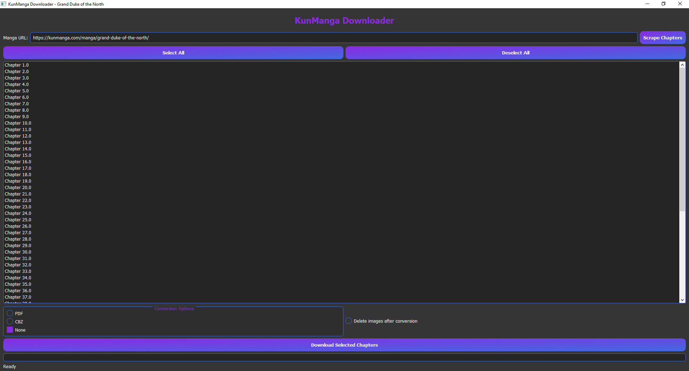

# KunManga Downloader

A powerful, threaded manga downloader with both CLI and GUI interfaces for downloading manga from KunManga.com. Features include selective chapter download, PDF/CBZ conversion, and optional image cleanup.



## Table of Contents
- [Features](#features)
- [Prerequisites](#prerequisites)
- [Installation](#installation)
- [Getting cf_clearance Cookie](#getting-cf_clearance-cookie)
  - [Chrome](#chrome)
  - [Edge](#edge)
  - [Firefox](#firefox)
  - [Brave](#brave)
  - [Using Cookie Extensions](#using-cookie-extensions)
- [Usage](#usage)
 - [CLI Version](#cli-version)
  - [GUI Version](#gui-version)
- [Configuration](#configuration)
- [Project Structure](#project-structure)
- [License](#license)

## Features

- **Dual Interface**: Interactive CLI and sleek GUI
- **Flexible Chapter Selection**: Download single chapters, ranges, or all chapters
- **Multiple Formats**: Convert to PDF or CBZ
- **Threaded Downloads**: Parallel chapter and image downloads for speed
- **Cloudflare Bypass**: Uses `cloudscraper` to handle Cloudflare protection

## Prerequisites

- Python 3.7+
- pip (Python package installer)

## Installation

1. Clone the repository:
   ```bash
   git clone https://github.com/Yui007/kunmanga_downloader
   cd kunmanga-downloader
   ```

2. Install the required packages:
   ```bash
   pip install -r requirements.txt
   ```

## Getting cf_clearance Cookie

Before using the downloader, you need to obtain the `cf_clearance` cookie from KunManga.com. This is required to bypass Cloudflare protection.

### Chrome

1. Open Chrome and navigate to [https://kunmanga.com](https://kunmanga.com)
2. Solve the CAPTCHA if presented
3. Press `F12` to open Developer Tools
4. Go to the "Application" tab
5. In the left sidebar, expand "Cookies" and click on "https://kunmanga.com"
6. Find the `cf_clearance` cookie in the list
7. Copy its value and paste it into your `cookies.json` file:
   ```json
   {
     "cf_clearance": "YOUR_CF_CLEARANCE_VALUE_HERE"
   }
   ```

### Edge

1. Open Microsoft Edge and navigate to [https://kunmanga.com](https://kunmanga.com)
2. Solve the CAPTCHA if presented
3. Press `F12` to open Developer Tools
4. Go to the "Application" tab
5. In the left sidebar, expand "Cookies" and click on "https://kunmanga.com"
6. Find the `cf_clearance` cookie in the list
7. Copy its value and paste it into your `cookies.json` file

### Firefox

1. Open Firefox and navigate to [https://kunmanga.com](https://kunmanga.com)
2. Solve the CAPTCHA if presented
3. Press `F12` to open Developer Tools
4. Go to the "Storage" tab
5. In the left sidebar, expand "Cookies" and click on "https://kunmanga.com"
6. Find the `cf_clearance` cookie in the list
7. Copy its value and paste it into your `cookies.json` file

### Brave

1. Open Brave and navigate to [https://kunmanga.com](https://kunmanga.com)
2. Solve the CAPTCHA if presented
3. Press `F12` to open Developer Tools
4. Go to the "Application" tab
5. In the left sidebar, expand "Cookies" and click on "https://kunmanga.com"
6. Find the `cf_clearance` cookie in the list
7. Copy its value and paste it into your `cookies.json` file

### Using Cookie Extensions

You can also use browser extensions to export cookies:

1. Install a cookie manager extension (e.g., "Cookie-Editor" for Chrome/Edge/Firefox/Brave)
2. Navigate to [https://kunmanga.com](https://kunmanga.com) and solve the CAPTCHA
3. Open the cookie extension and find the `cf_clearance` cookie
4. Export all cookies to a JSON file and save it as `cookies.json` in the project directory

## Usage

### CLI Version

Run the CLI version with:
```bash
python main.py
```

Follow the interactive prompts to:
1. Enter the manga URL
2. Select chapters to download
3. Choose conversion format (PDF/CBZ/None)
4. Decide whether to delete images after conversion

### GUI Version

Run the GUI version with:
```bash
python gui.py
```

The GUI provides the same functionality as the CLI with a user-friendly interface:
1. Enter the manga URL in the input field
2. Click "Scrape Chapters" to fetch the chapter list
3. Select chapters using the list and "Select All"/"Deselect All" buttons
4. Choose conversion format and cleanup options
5. Click "Download Selected Chapters" to start the download

**Pro Tip**: You can quickly select or deselect multiple chapters by holding down the left mouse button and drag your cursor up or down the chapter list to quickly select or deselect multiple chapters.

## Configuration

Adjust settings in `config.py`:
- `MAX_CHAPTER_THREADS`: Maximum concurrent chapter downloads (default: 5)
- `MAX_IMAGE_THREADS`: Maximum concurrent image downloads per chapter (default: 10)
- `DOWNLOAD_PATH`: Directory for downloaded manga (default: './downloads/')
- `DELETE_IMAGES_AFTER_CONVERSION`: Delete original images after conversion (default: True)

## Project Structure

```
kunmanga_downloader/
├── main.py                 # CLI entry point
├── gui.py                  # GUI interface
├── config.py               # Configuration parameters
├── cookies.json            # Cloudflare cookies
├── requirements.txt        # Python dependencies
├── gui.PNG                 # GUI screenshot
└── downloader/
    ├── __init__.py
    ├── scraper.py          # Manga/chapter scraping
    ├── download.py         # Threaded image downloading
    ├── converter.py        # PDF/CBZ conversion
    └── utils.py            # Helper functions
```

## License

This project is licensed under the MIT License - see the [LICENSE](LICENSE) file for details.